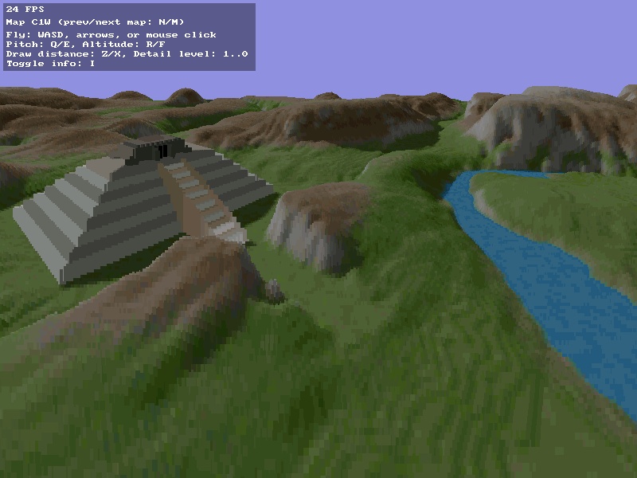

Nim VoxelSpace Demo
===================

VoxelSpace engine demo, based on [original code](https://github.com/s-macke/VoxelSpace) of [Sebastian Macke](https://github.com/s-macke).

Written in Nim using [sdl2_nim](https://github.com/Vladar4/sdl2_nim) library.

Requires
--------

* [sdl2_nim](https://github.com/Vladar4/sdl2_nim)
* Runtime libraries for:
  * SDL2
  * SDL2_gfx
  * SDL2_image
  * libpng
  * zlib

Controls
--------

| Action        | Control                       |
|---------------|-------------------------------|
| Prev/next map | N/M                           |
| Fly           | WASD, Arrows, or mouse click  |
| Pitch         | Q/E                           |
| Altitude      | R/F                           |
| Draw distance | Z/X                           |
| Detail level  | 1, 2, 3, 4, 5, 6, 7, 8, 9, 0  |
| Toggle info   | I                             |

License
-------

The software part of the repository is under the MIT license. Please read the license file for more information. Please keep in mind, that the Voxel Space technology might be still [patented](https://patents.justia.com/assignee/novalogic-inc) in some countries. The color and height maps are reverse engineered from the game Comanche and are therefore excluded from the license.

